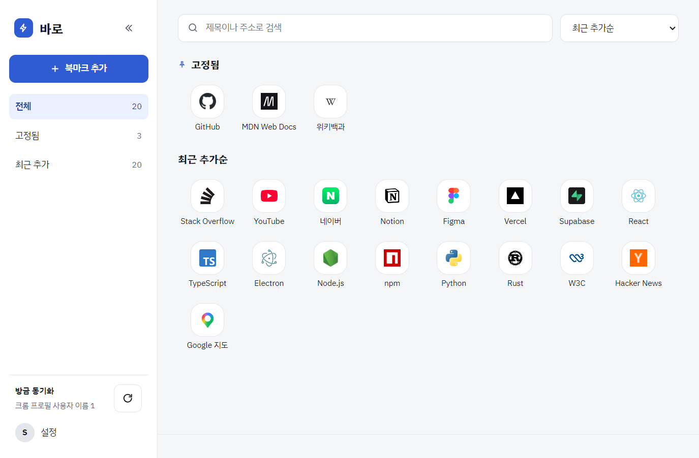

# 바로 (baro)

크롬 북마크를 폰 홈 화면처럼 아이콘 그리드로 보여 주고, 한 번 클릭으로 여는 Windows 데스크톱 앱. 수익 목적이 없는 학습용 프로젝트다.



<sub>화면의 북마크는 설명용 가짜 데이터(공개 사이트 20개)다.</sub>

## 설치해서 쓰기

1. 설치 파일 `baro-<버전>-setup.exe`를 실행한다. 만드는 방법은 [개발 문서 '설치 파일 만들기'](docs/development.md#설치-파일-만들기)
   - 코드 서명이 없어서 처음 실행할 때 "Windows의 PC 보호"(SmartScreen) 창이 뜰 수 있다. [추가 정보] → [실행]
2. 원클릭 설치다. 폴더 선택·관리자 권한 없이 사용자 폴더(`%LOCALAPPDATA%\Programs\baro`)에 설치되고, 끝나면 앱이 켜진다. 바탕 화면과 시작 메뉴에 "바로" 바로가기가 생긴다
3. [Google로 계속하기] → 기본 브라우저에서 로그인 → 앱으로 돌아온다. 첫 로그인 때 계정이 만들어진다
4. 처음 한 번은 가져올 크롬 프로필을 고르고 [가져오기]. 그다음부터는 앱을 열 때마다 자동으로 동기화한다(설정에서 끌 수 있다)

### 제거

설정 → 앱 → 설치된 앱 → "바로" → 제거.
로그인 정보와 고른 크롬 프로필(`%APPDATA%\baro`)은 **남는다**. 다시 설치하면 그대로 이어진다. 로그인 정보는 이 Windows 계정에서만 풀리게 암호화되어 있지만, 공용 PC라면 제거하기 전에 앱에서 **로그아웃**한다(로그아웃하면 지워진다).

크롬에서 북마크를 추가·삭제하는 즉시 반영하려면 크롬 확장(선택)을 설치한다 → [개발 문서 '크롬 확장'](docs/development.md#크롬-확장-선택)

## 개인정보 안내

앱 설정 화면(계정 카드)에도 같은 안내가 있다: "아이콘을 불러오려고 북마크한 사이트의 도메인을 Google에 보냅니다. 주소의 나머지 부분과 계정 정보는 보내지 않습니다."

- 그리드의 아이콘은 Google 파비콘 서비스(`https://www.google.com/s2/favicons?domain=<도메인>`)에서 받는다. Google은 요청한 PC의 IP와 도메인 목록을 알 수 있다
- 바로는 북마크의 제목·주소와 앱에서 연 횟수를 이 프로젝트의 서버(Supabase)에 저장한다. 크롬의 방문 기록이나 비밀번호는 읽지 않는다
- 사이트 자체 아이콘 저장·끄기 설정은 v1.1 후보다(`docs/01-spec.md` '메인 그리드 규칙')

## 개발

```bash
pnpm install
cp apps/api/.env.example apps/api/.env          # 서버 비밀값. 값은 각자 채운다
cp apps/desktop/.env.example apps/desktop/.env  # 앱 공개값
pnpm dev:api                                   # http://localhost:3000/api/v1/health
pnpm dev:desktop                               # Electron 창(핫 리로드)
```

> **주의:** `apps/api/.env`에 DB 주소(`DATABASE_POOLER_URL`)가 있으면 `pnpm test`가 그 DB에 가짜 사용자(`…-test-<uuid>@example.com`)를 만들었다가 지운다. 개발과 운영이 같은 Supabase 프로젝트면 **운영 DB에 가짜 사용자가 생긴다**(테스트가 실패하면 남을 수 있다). DB 없이 돌리려면 `pnpm --filter "!@baro/api" test`.

명령어 전체, 확장 설치, 설치 파일 만들기와 함정, 폴더 구조, 알려진 한계는 [개발 문서](docs/development.md). 계획서와 명세는 [`CLAUDE.md`](CLAUDE.md)와 [`docs/`](docs/), 진행 상황은 [`PROGRESS.md`](PROGRESS.md).
